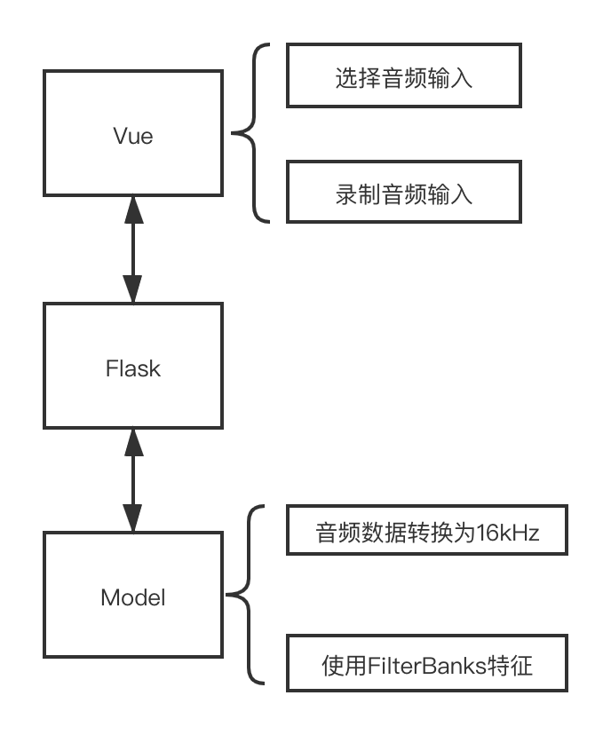

### 总体架构

前端使用Vue，后端使用Falsk，总体架构如下：
{width=50%}

```bash
# tree -L 1
├── LICENSE
├── MANIFEST.in
├── README.md
├── README_en.md
├── Vue                          # 前端Vue
├── automatic_speech_recognition # 模型的构建
├── checkpoint                   # 保存checkpoint
├── data                         # 训练数据
├── environment-gpu.yml
├── environment.yml
├── examples
├── flask_server                 # 后端Flask
├── img
├── predict.py                   # 模型预测
├── run.sh
├── setup.py
├── tests
├── train.py                     # 模型的训练
├── transfer
└── utils
```

### Automatic Speech Recognition

使用`tensorflow==2.1.0`，预测过程如下所示，注意音频需要是16kHz。

```python
import automatic_speech_recognition as asr

file = 'to/test/sample.wav'  # sample rate 16 kHz, and 16 bit depth
sample = asr.utils.read_audio(file)
pipeline = asr.load('deepspeech2', lang='en')
pipeline.model.summary()     # TensorFlow model
sentences = pipeline.predict([sample])
```

<br>

模型支持英语（感谢[Open Seq2Seq](https://nvidia.github.io/OpenSeq2Seq/html/speech-recognition.html#speech-recognition)）。下表列出了英语基准LibriSpeech dev-clean数据集的评估结果。作为参考，DeepSpeech（Mozilla）的WER约为7.5％，而最新技术（RWTH Aachen University）的WER约为2.3％（最新评估结果可在[此处找到](https://paperswithcode.com/sota/speech-recognition-on-librispeech-test-clean)）。他们俩都使用外部语言模型来提高结（也就是在Encoder-Decoder之上加一个语言模型）。相比之下，人类在这里达到了5.83％的WER（LibriSpeech dev-clean）

| Model Name    | Decoder | WER-dev |
| :---          |  :---:  |  :---:  |
| `deepspeech2` | greedy  |   6.71  |

<br>

模型的训练过程如下所示：

```python
import numpy as np
import tensorflow as tf
import automatic_speech_recognition as asr
# dataset = asr.dataset.Audio.from_csv('data/train.csv', batch_size=32)
# dev_dataset = asr.dataset.Audio.from_csv('dev.csv', batch_size=32)
dataset = asr.dataset.Audio.from_csv('data/TIMIT/timit_test.csv', batch_size=2)
dev_dataset = asr.dataset.Audio.from_csv(
    'data/TIMIT/timit_test.csv', batch_size=2)
alphabet = asr.text.Alphabet(lang='en')
features_extractor = asr.features.FilterBanks(
    features_num=160,
    winlen=0.02,
    winstep=0.01,
    winfunc=np.hanning
)
model = asr.model.get_deepspeech2(
    input_dim=160,
    output_dim=29,
    rnn_units=800,
    is_mixed_precision=False
)
# model.load_weights(
#     'automatic_speech_recognition/load/models/en-deepspeech2-weights-0.1.h5')
optimizer = tf.optimizers.Adam(
    lr=1e-4,
    beta_1=0.9,
    beta_2=0.999,
    epsilon=1e-8
)
decoder = asr.decoder.GreedyDecoder()
pipeline = asr.pipeline.CTCPipeline(
    alphabet, features_extractor, model, optimizer, decoder
)
pipeline.fit(dataset, dev_dataset, epochs=1)
pipeline.save('./checkpoint')

test_dataset = asr.dataset.Audio.from_csv(
    'data/TIMIT/timit_test.csv', batch_size=1)
wer, cer = asr.evaluate.calculate_error_rates(pipeline, test_dataset)
print(f'WER: {wer}   CER: {cer}')

```

<br>

#### 参考

The fundamental repositories:
- Baidu - [DeepSpeech2 - A PaddlePaddle implementation of DeepSpeech2 architecture for ASR](https://github.com/PaddlePaddle/DeepSpeech)
- NVIDIA - [Toolkit for efficient experimentation with Speech Recognition, Text2Speech and NLP](https://nvidia.github.io/OpenSeq2Seq)
- RWTH Aachen University - [The RWTH extensible training framework for universal recurrent neural networks](https://github.com/rwth-i6/returnn)
- TensorFlow - [The implementation of DeepSpeech2 model](https://github.com/tensorflow/models/tree/master/research/deep_speech)
- Mozilla - [DeepSpeech - A TensorFlow implementation of Baidu's DeepSpeech architecture](https://github.com/mozilla/DeepSpeech) 
- Espnet - [End-to-End Speech Processing Toolkit](https://github.com/espnet/espnet)
- Sean Naren - [Speech Recognition using DeepSpeech2](https://github.com/SeanNaren/deepspeech.pytorch)
- [TIMIT 格式转换](https://github.com/mozilla/DeepSpeech/blob/master/bin/import_timit.py)
- [Deep Speech介绍](https://www.youtube.com/watch?v=P9GLDezYVX4)
- [更改音频频率](https://github.com/mozilla/DeepSpeech/pull/1203)
